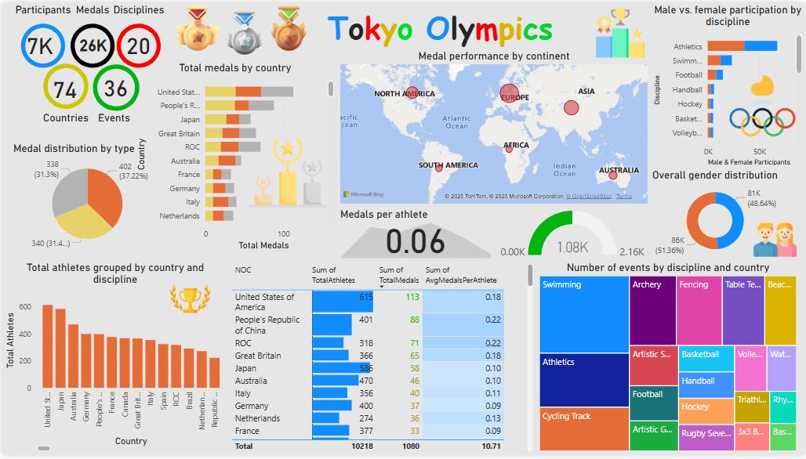

# Tokyo Olympics Analytics | Azure Data Engineering Project

## Introduction
The **Tokyo Olympics Analytics Project** demonstrates the implementation of an **end-to-end data engineering pipeline** using **Microsoft Azure services**. The project focuses on ingesting, transforming, and visualizing large volumes of data related to the **Tokyo Olympics**, providing actionable insights via an interactive **Power BI dashboard**.

The project covers the complete data lifecycle, from **data ingestion** using **Azure Data Factory** to **data transformation** using **Azure Databricks** and **data modeling** using **Azure Synapse Analytics**. The final insights are presented through **Power BI**, making it a comprehensive solution for scalable analytics.

## Project Architecture
The architecture of this project involves several Azure services working together to build a scalable, reliable, and efficient data pipeline:

### **High-Level Architecture Diagram**

### **Key Components**
1. **GitHub:** The project’s primary code repository and source for input datasets.
2. **Azure Data Factory (ADF):** Orchestrates the ingestion of raw data from GitHub to **Azure Data Lake Storage Gen2**.
3. **Azure Data Lake Storage Gen2:** Stores both raw and transformed data in structured and unstructured formats.
4. **Azure Key Vault:** Provides secure storage and access to secrets (e.g., storage account keys and Databricks credentials).
5. **Azure Databricks:** Performs data transformation using **PySpark** and saves the transformed data in **Parquet format**.
6. **Azure Synapse Analytics (Serverless SQL):** Creates views over the transformed Parquet data, enabling seamless querying.
7. **Power BI:** Visualizes data insights through interactive dashboards.

This architecture ensures a **scalable**, **secure**, and **cost-effective** way of handling large datasets while making the analytics pipeline easily maintainable.

## **Project Workflow**
1. **Data Ingestion**: Raw data is pulled from GitHub using **Azure Data Factory** and stored in the **raw-data container** in Azure Data Lake Storage Gen2.
2. **Data Transformation**: Using **Databricks with PySpark**, the raw data is transformed and stored in Parquet format within the **transformed-data container**.
3. **Data Modeling**: Views are created in **Azure Synapse Analytics** using **serverless SQL** for easy querying.
4. **Data Visualization**: **Power BI dashboards** display key metrics, such as medal counts, athlete participation, gender distribution, and performance by continent.

---

## **Technologies Used**
- **Azure Services**:
  - Azure Data Factory
  - Azure Data Lake Storage Gen2
  - Azure Databricks
  - Azure Key Vault
  - Azure Synapse Analytics (Serverless SQL)
  - Power BI

- **Programming Languages**:
  - Python (PySpark for transformations)
  - SQL (Serverless SQL for querying views)

- **Other Tools**:
  - GitHub (Code repository and data source)
---

## **Key Features**
- **End-to-End Data Pipeline**: Automated data ingestion, transformation, and loading.
- **Transformations with PySpark**: Scalable transformations on large datasets using **Azure Databricks**.
- **Serverless SQL Views**: Optimized for querying the transformed Parquet data in **Azure Synapse**.
- **Interactive Dashboard**: Final insights visualized in **Power BI** with dynamic filtering.

---
## **Dataset Used**
The dataset for this project comes from the Tokyo Olympics, comprising information about participating athletes, countries, events, disciplines, medal distributions, and gender participation. The data was sourced from GitHub and includes key tables such as athletes, medals, and events, providing a rich foundation for analysis.

Here is the dataset used in the Project: https://github.com/sureshchalla0139/Tokyo-Olympics-AzureDataEngineering-Project/tree/main/Data

Original Data Source: https://www.kaggle.com/datasets/arjunprasadsarkhel/2021-olympics-in-tokyo/

---

## **Project Setup**

### **Step 1: Clone the Repository**

git clone https://github.com/sureshchalla0139/Tokyo-Olympics-AzureDataEngineering-Project.git

cd your_repository

### **Step 2: Configure Azure Resources**
Ensure the following Azure resources are set up:

Azure Data Lake Storage Gen2
Azure Data Factory
Azure Databricks
Azure Key Vault
Azure Synapse Analytics

### **Step 3: Configure Key Vault Secrets**
Add secrets in Azure Key Vault for:

Storage account access keys
Databricks access

### **Step 4: Run the Pipeline**
Trigger the Azure Data Factory pipeline to load raw data into Data Lake Storage.
Run Databricks notebooks for PySpark transformations.
Create views in Azure Synapse Analytics using provided SQL scripts.

### **Step 5: Power BI Visualization**
Import Synapse views into Power BI.
Build visuals according to the provided design.

#### **Data Model**

#### **Dashboard**

### **Project Insights**
The following key insights are visualized in the Power BI dashboard:

- Medals Overview: Total medals won by country and distribution of gold, silver, and bronze medals.
- Athletes Participation: Total athletes by country and discipline.
- Gender Distribution: Male and female participation by discipline.
- Event Insights: Events grouped by country and discipline.
- Continent-Level Analysis: Medal performance and efficiency by continent.

### **Key Takeaways**
This project demonstrates how to design and build an end-to-end data pipeline using various Azure services. It showcases the power of serverless processing, PySpark transformations, and interactive reporting to generate actionable insights from large datasets.
